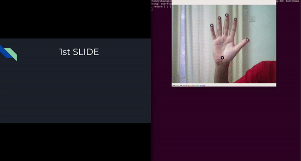

## Dynamic Hand Gesture Recognition

This repo showcases simple dynamic hand gesture control using Google's [Mediapipe HandTracking Model](https://google.github.io/mediapipe/getting_started/building_examples.html#desktop) to perform detection and tracking. The python implementation for the mediapipe handtracking can be found [here](https://github.com/metalwhale/hand_tracking).

[pyautogui](https://pyautogui.readthedocs.io/en/latest/) is used for keyboard interfacing.

2 gestures, left swipe and scroll up, have been implemented in this repo, demonstrated to control slides during a presentation.

